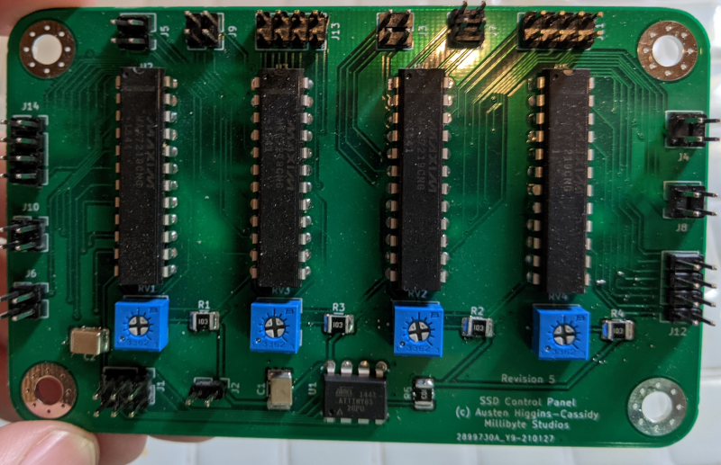

# DISARMED!

Heavily inspired by [Keep Talking and Nobody Explodes](https://keeptalkinggame.com/) and [Bomb Corp](https://www.jackboxgames.com/bomb-corp/).

A physical "Bop-It for adults". 

This ammounts to a electroncs and software programming project, with a side-helping of game design and art!

## The SSD Control Panel
The SSD Control panel provides control lines (including manually adjustable brightness) for up to 8 SSD panels with 4 digits each. That is a grand total of 32 digits per board, with 4 brightness zones.
This board is driven by an ATTiny85, which provide an I2C interface to the system at large, and shifts out data to the LED driver chips.
Software will come later.

## The Analog Control Panel
The analog control panel uses DAC and ADC chips to provide analog read and write functions. External I2C interface provided by an ATTiny85. 
The software drivers for this board are still in the works. It will eventually be able to read from analog inputs and write to some interesting analog displays!

## The Switch Control Board
The Switch Control Board uses a number of digital I/O expanders to provide a vast number of pulled-up digital inputs. It has an ATMega328 on board. The Mega chip, with more ports and power, gives us and on-board USB port for programming and diagnostics. The many serial peripherals juggle the master relationship with the expanders and the slave relationship with the external system. Some pins are enabled to drive optional LEDs connected to the switches or mounted on the display.

The software for this is not yet written, but I'm looking forward to the increased power and peripherals vs the ATTiny85.

### The Switch Board
The switch panel contains both analog potentiometers and SPST switches. These will be the primary user input at some point.
Shown is an early prototype of the layout. Eventually more complex and varied inputs will be added. Some of the empty cutouts are for SSD displays not pictured.

The eventual plan is to laser cut and paint and acrylic panel to fit into a case. An alternative may be to 3D print some slotable modules and a motherboard panel to hold them.

## The LED Module
The LED Module drives a series of LED Bar Graph displays, including a few unique circular displays.
The board is essentially a giant shift register that can source proper current to each LED.

Lesson Learned: Double, Triple, Quadruple check your sizing on parts. I eneded up using an ultra-fine pitch SMD resistor array.
I managed to get a few of them down successfully, but ended up bridging the others. My solution was to cut the traces and manually solder THT resistors on the back of the panel.
Fixed in the other designs: used much larger chip resistors.

The board is driven by an onboard ATTiny85, running some custom firmware that includes the TinyWireS library. Unfortunately still interating on the software, but the chip provides and I2C slave that allows a master to write to an output array: buffering the shift register output.
The same set of pins is also used as the ISP interface.

A NodeMCU ESP8266 breakout is being used as a i2c master test.

## The SSD Module
The Seven Segment Display Module is something I unfortunately based on the LD8041C/D series of 20mm seven segment displays.
Having bought several 10 years ago, I found that they seem to be no longer manufactured, so I just have the one board that is finished.
JCLPCB manufactures in minimum lots of 5, so I have 4 useless, large PCBs. At least the one works.

(For the REV2 board, the one I got manufactured, I accidently left out a single line segment of a trace when refactoring some of the runs... thankfully, I was able to bridge the gap with a single wire. This is fixed in REV3+).

In the future, I'll source some new SSD parts and update the boards, possibly with a denser layout.

The board uses MAX7219CNG LED/IO drivers over SPI. A MCP41010 is used to digitally control ISET, though in practice this was set to it's maximum value, and the SSD brightness is controlled via the Intensity register rin the MAX7219.

The test code was prototyped on a NodeMCU ESP8266 breakout, and then ported down to a Adafruit Trinket (ATTiny85). The TinySPI library was used to bridge the gaps.

I tried using libraries for both the MAX7219 and MCP41010 chip, but took exception to the complexity of the code and ended up implementing my own simple driving functions.
Future revisions of the board may implement an I2C interface and use an on-board MCU to drive the MAC7219 and MCP41010.